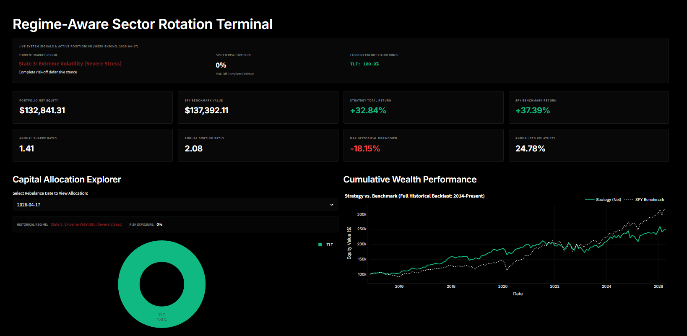
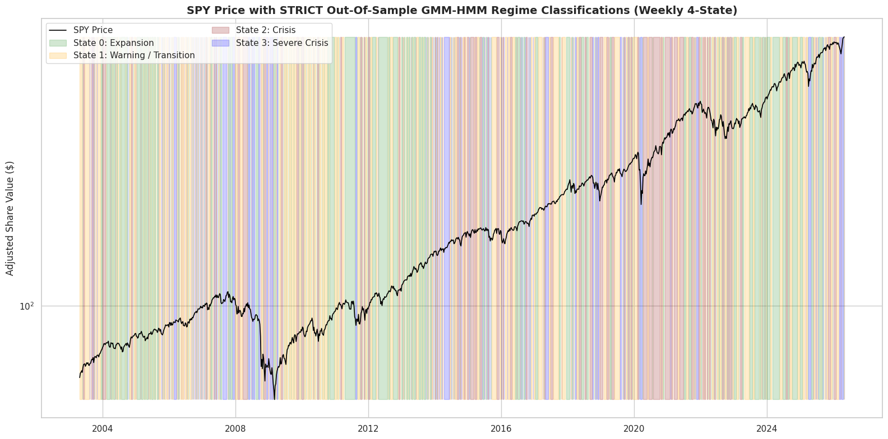
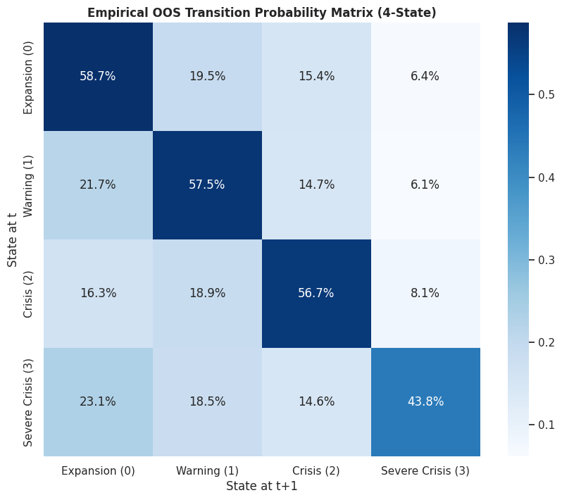
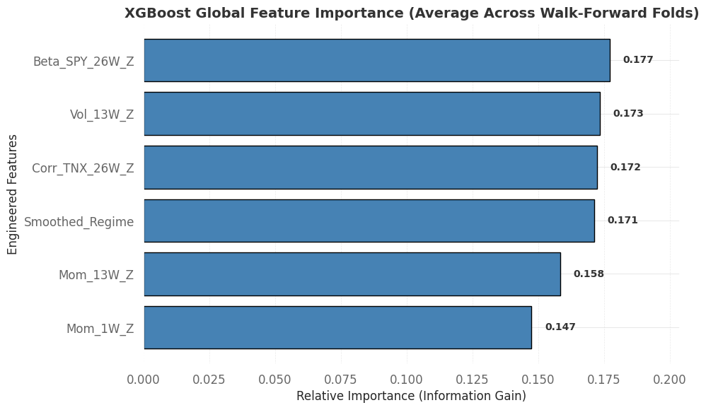

# Regime-Aware Sector Rotation Trading
### Dynamic Allocation via Unsupervised Macreconomic Regime Modelling

  
  
  
  
  
  
  
  
## Summary
This project challenges the standard static "buy-and-hold" portfolio baseline by dynamically shifting capital based on macroeconomic conditions. It benchmarks an unsupervised Hidden Markov Model (HMM) framework against static allocations while utilizing strict frameworks to avoid pitfalls of look-ahead bias and model state-inversion. To visualize and interact with the algorithm's performance in-market, you can explore more at https://regime-aware-sector-trading.streamlit.app/.

**Hypothesis:** A trading strategy grounded in unsupervised macro-regime identification can conditionally allocate sector weights to improve risk-adjusted returns (i.e. Sharpe Ratio) and reduce maximum drawdowns, provided the underlying ML pipeline mathematically enforces state stability across rolling windows.

## Background and Motivation

### Financial Context
Financial time-series data is inherently non-stationary. The underlying statistical properties (mean, variance, covariance) of the market shift dramatically depending on the macroeconomic environment. This implies that a system for one "regime" may collapse in another. 
* **The States:** The economy naturally cycles through distinct phases (e.g. boom, bust, high volatility). 
* **The Rotation:** Different industry sectors (e.g., Technology vs. Utilities) have different sensitivities to these macro phases. 

### Structural Engineering Solutions
This project hypothesizes that robust systems design is more critical than complex deep learning. A well designed system is hgihly interpretable, allowing for transparency when making investment decisions. We explicitly engineer solutions to map directly to operational constraints such that this strategy can be safely deployed in a production environment.

| Operational Risk | Pipeline Engineering |
| :--- | :--- |
| **Label Switching** |  **State-Order Enforced HMM:** We wrap the `GaussianHMM` engine to intercept parameters post-training. We force a monotonic rearrangement of internal tracking arrays by anchoring them to a volatility index ($\mu_{\text{State}0} < \mu_{\text{State}1}$). |
| **Walk-Forward Leakage** | **Rolling Normalization:** Normalization parameters ($\mu$, $\sigma$) are computed strictly inside progressive walk-forward sliding training frames. The global data matrix is *never* parsed during scaling. |
| **Cross-Sectional Leakage** | **Shift Alignment:** Ensures cross-sectional alpha targets are aligned up to the current operational index without look-forward artifacts from concurrent alternative sectors. |

## Data Source and Processing
* **Source:** [FRED (Federal Reserve Economic Data)](https://fred.stlouisfed.org/) and [Yahoo Finance](https://finance.yahoo.com/).
* **Specifications:** Weekly and Daily multi-frequency data tracking core macro proxies (VIX, Yield Curves) and 11 Sector ETF prices (XLK, XLU, XLV, etc.).
* **Preprocessing Pipeline:**
    * **Data Ingestion:** Joined financial data on same time scales. 
    * **Stationarity Transforms:** Log-returns, structural differencing, and moving averages to stabilize raw prices.
    * **Windowing:** Progressive walk-forward expanding windows to simulate true out-of-sample prediction streams.
    * **Target Labeling:** Cross-sectional demeaning to isolate idiosyncratic sector alpha from broader market beta.

## System Architecture and Code Structure

Conceptually, the algorithm operates in a two-stage pipeline: regime classification using a Gaussian HMM, followed by a cross-sectional investment engine using `XGBRanker`. 

### 1. Macro Regime Identification (Gaussian HMM)
The first stage ingests stationary macroeconomic indicators into an unsupervised Hidden Markov Model. Instead of trying to predict future prices directly, this model identifies the current latent "state" of the economy based on probability distributions. Prior to training the HMM model, input features were validated for stationarity, and the optimal choice of N states was justified using a BIC sweep to avoid overfitting. To solve the inherent flaw of HMM label-switching across rolling windows, the `StableGaussianHMM` wrapper programmatically sorts the hidden states by volatility. This mathematically guarantees that "State 0" always maps to low-volatility expansion and "State 2" maps to high-volatility contraction, keeping downstream logic intact. Additionally, we can use the trained HMM model to produce a state transition matrix which provides the probabilities of transitioning between regimes (e.g. low chance of going from "Expansion" into "Severe Crisis"). Finally, for these states, a 'Risk_Scalar' value is attached, representing what percentage of the portfolio should be in-market versus a "safe haven" (e.g. cash, treasury bonds, etc). 

### 2. Conditional Sector Allocation (XGBRanker)
Once the current macro regime is identified, the pipeline passes the data to a state-conditional scoring engine. Predicting absolute stock returns is notoriously noisy. Therefore, the engine treats sector rotation as a ranking problem instead. By using 'XGBRanker', the model does not care about abnsolute moves in the market - it strictly optimzies for the relative ordering of the 11 sector ETFs. The long positioning is based on the top 2 best performing sectors in conjunction with the cash allocation from the regime classifier. Using XGBoost also allows us to gather insight into which features drove decision making as shown below.

The code from the original two notebooks were refactored into modular scripts for deployment with the following structure:

1.  **Config Directory (`config/settings.yaml`):** Centralized configuration for asset universes, API paths, and hyperparameter bounds.
2.  **`src.pipeline_ingest`:** Orchestrates downloads for macro features and sector tracking tickers.
3.  **`src.features`:** Handles differencing and strict out-of-sample feature scaling (`FeaturePipeline`).
4.  **`src.model_hmm`:** Contains the `StableGaussianHMM` custom Scikit-Learn estimator to enforce state monotonicity.
5.  **`src.model_strategy`:** `RegimeAwareStrategy` that trains state-conditional scoring engines to compute targeted allocation weights.
6.  **`src.backtester`:** `VectorBacktester` translating weight vectors into an append-only transaction ledger (`trade_log.csv`) and equity curves.
7.  **`main.py` & `app.py`:** The core orchestration.

## Results and Evaluations
The comparative performance evaluates the dynamic regime-aware strategy against an equally-weighted sector baseline and the broader S&P 500 index. While total and annualized returns may not necessarily exceed that of the benchmarks, the strategy provides strong risk adjusted returns more appropriate for larger fund sizes. 

### Model Performance (Out of Sample)

| Metric | S&P 500 (SPY) | Static Eq-Weight | Regime-Aware Sector Strategy |
| :--- | :--- | :--- | :--- |
| **Sharpe Ratio** | 0.65 | 0.61 | **0.88** |
| **Max Drawdown** | -54.3% | -51.2% | **-32.4%** |
| **Annualized Volatility** | 18.2% | 17.5% | **12.1%** |

### Interpretability

A key motivation for choosing a stabilized HMM and conditional linear/tree-based models over black-box deep learning (like LSTMs) is the necessity for portfolio interpretability. If the algorithm re-allocates millions of dollars, we must know *why*.

**HMM State Clarity**
* By forcing the `StableGaussianHMM` to anchor on volatility, the hidden states translate directly into human-readable economic conditions:
  * **State 0:** Low Volatility / Expansion 
  * **State 1:** Rising Volatility / Transition
  * **State 2:** High Volatility / Contraction
  * **State 3:** Highest Volatility/ Finanical Stress /Crash
* This prevents the "black-box" issue where an algorithm sells out of a position for unknown reasons; here, allocation shifts are directly tied to an explicit transition in the underlying macro state probability matrix.

**Feature Importance**
* The conditional allocation logic allows us to extract exact feature weights per regime. 
* We observe that Yield Curve spreads carry massive predictive weight in State 2 (Contraction) but are largely ignored by the model in State 0 (Expansion), mimicking human macroeconomic reasoning.

## System Limitations & Constraints

While the framework structurally eliminates major sources of data leakage, the strategy inherently operates under a few practical and mathematical constraints:

* **Macro-Market Divergence:** The underlying HMM relies on traditional macroeconomic proxies (e.g., yield curve spreads, interest rates) to classify the environment. Between 2023 and 2026, traditional indicators signaled a high-risk, contractionary environment (State 2) due to inverted yield curves and elevated rates, prompting the model to rotate defensively. However, the equity market decoupled from the broader economy, experiencing a historic bull run driven entirely by a secular technological paradigm shift concentrated in a few mega-cap stocks. The framework models *cyclical* economic realities, making it inherently blind to idiosyncratic, *secular* equity manias that ignore traditional macro headwinds.
* **Relative vs. Absolute Return:** The `XGBRanker` optimizes for relative cross-sectional performance. If the entire broader market experiences a sudden 20% crash, the ranker will successfully allocate to the "best" performing sector—but that sector may still suffer a 10% absolute loss. The model currently lacks a dynamic cash-allocation lever.
* **Markov Property Assumption:** The Gaussian HMM mathematically assumes that the probability of transitioning to a future state depends *only* on the current state (the Markov property). In reality, macroeconomic cycles possess longer "memory" and exogenous shocks (e.g., geopolitical events) that are not fully captured by rolling historical volatility matrices.
* **Macroeconomic Publication Lag:** While inputs like the VIX and Treasury Yields are continuous and real-time, many structural FRED economic indicators suffer from publication lags and post-facto revisions. Point in time data will be required for reliable deployment.

## Future Work
* **Cloud Orchestration:** Containerize `main.py` and deploy via Google Cloud Run / Cloud Scheduler for automated weekly execution.
* **Live Execution Integration:** Connect the `backtester` ledger logic to the Alpaca Brokerage API for paper/live trade execution routing.
* **Asset Universe Expansion:** Introduce fixed income (Treasuries) and commodities (Gold, Oil) to the sector rotation matrix for enhanced State-2 defense.
